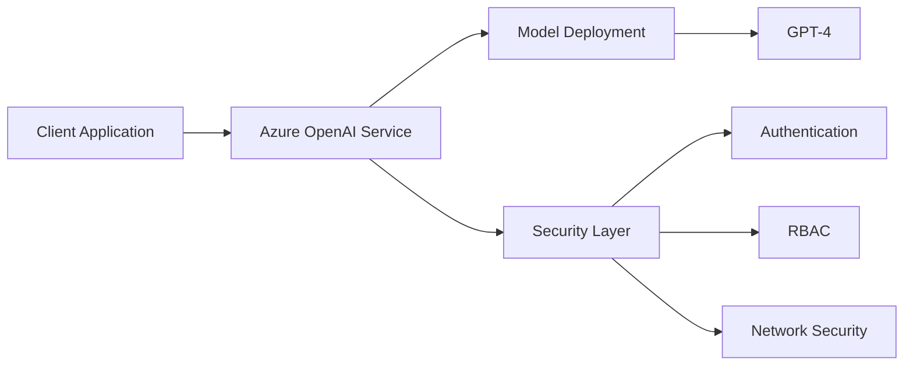
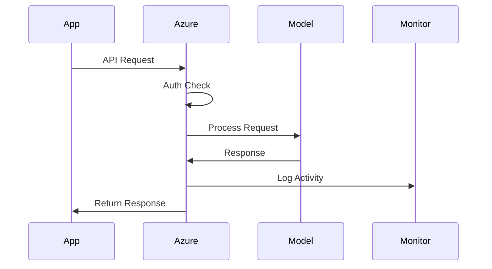
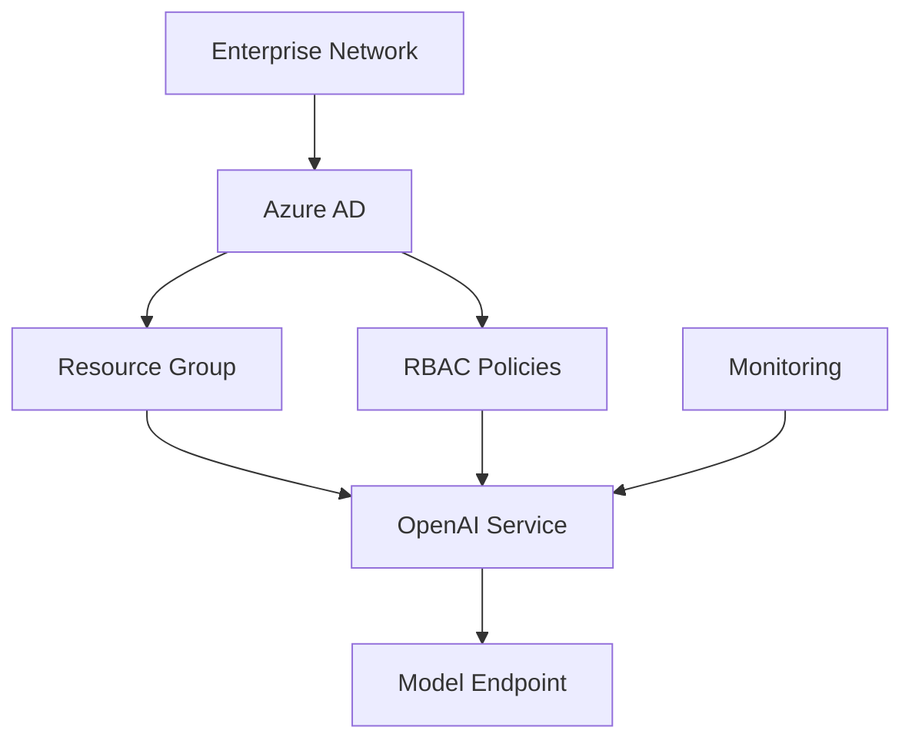
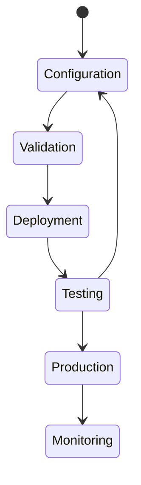

# Module 2: Environment Setup & Security Configuration
## Instructor Guide

## 🎯 Module Overview
This module focuses on setting up a secure and scalable environment for AI model deployment in enterprise settings. Students will learn about Azure OpenAI's architecture, security considerations, and best practices for production deployments.

## 🧠 Theoretical Background

### Azure OpenAI Service Architecture

Key Points to Explain:
- Azure OpenAI as a managed service layer
- Model deployment and versioning
- Security integration with Azure ecosystem
- Role of each component in the architecture

### Enterprise Data Flow

Teaching Notes:
1. Emphasize the request lifecycle
2. Point out security checkpoints
3. Discuss monitoring importance
4. Explain error handling

### Security Architecture

Key Security Concepts:
- Azure Active Directory integration
- Role-Based Access Control (RBAC)
- Network security groups
- Monitoring and auditing

### Deployment Process

## 📚 Teaching Guidelines

### 1. Introduction (15 minutes)
- Start with the architecture diagram
- Explain each component's role
- Connect to real-world scenarios
- Address initial questions

### 2. Common Student Questions

#### Q: "Why use Azure OpenAI instead of direct OpenAI API?"
Answer points:
- Enterprise security integration
- Compliance and governance
- SLA guarantees
- Azure ecosystem benefits

#### Q: "How does authentication work?"
Explain:
- Azure AD integration
- API key management
- Token-based auth
- Best practices

### 3. Exercise Walkthrough Tips

#### Exercise 1: Azure Setup
- Show the Azure portal interface
- Explain resource group organization
- Demonstrate quota management
- Point out common pitfalls

#### Exercise 2: Security Configuration
- Emphasize security best practices
- Show RBAC configuration
- Demonstrate monitoring setup
- Explain audit logging

#### Exercise 3: Deployment Validation
- Walk through deployment steps
- Show validation techniques
- Demonstrate troubleshooting
- Explain monitoring dashboards

## 🎓 Learning Objectives Breakdown

1. Technical Understanding
   - Azure OpenAI architecture
   - Security components
   - Deployment process
   - Monitoring systems

2. Practical Skills
   - Environment configuration
   - Security implementation
   - Deployment management
   - Problem diagnosis

3. Best Practices
   - Security protocols
   - Deployment strategies
   - Monitoring setup
   - Maintenance procedures

## 🔍 Assessment Guidelines

### Knowledge Validation
Look for understanding of:
- Architecture components
- Security principles
- Deployment processes
- Monitoring strategies

### Skills Validation
Ensure students can:
- Configure environments
- Implement security
- Deploy models
- Set up monitoring

## 📝 Notes on Student Engagement

### Discussion Prompts
1. "How would you secure an AI model in your organization?"
2. "What monitoring metrics are crucial for AI deployments?"
3. "How do you handle model updates in production?"

### Real-World Connections
- Share enterprise deployment stories
- Discuss actual security incidents
- Relate to students' work environments

## 🚀 Extended Learning

### Advanced Topics
- Custom model deployment
- Advanced security configurations
- Performance optimization
- Disaster recovery

### Resources
- Azure OpenAI documentation
- Security best practices guides
- Monitoring and logging guides
- Case studies

## ⚠️ Common Pitfalls

### Setup Issues
- Quota limitations
- Permission problems
- Network constraints

### Security Mistakes
- Exposed API keys
- Insufficient RBAC
- Missing monitoring

## 🎯 Success Criteria

Students should be able to:
1. Explain the Azure OpenAI architecture
2. Configure secure environments
3. Implement proper monitoring
4. Deploy and validate models

## 🔄 Feedback Loop

Encourage students to:
- Ask questions
- Share challenges
- Propose solutions
- Discuss real scenarios

Remember: The goal is to build confidence in enterprise AI deployment while maintaining security and best practices.
