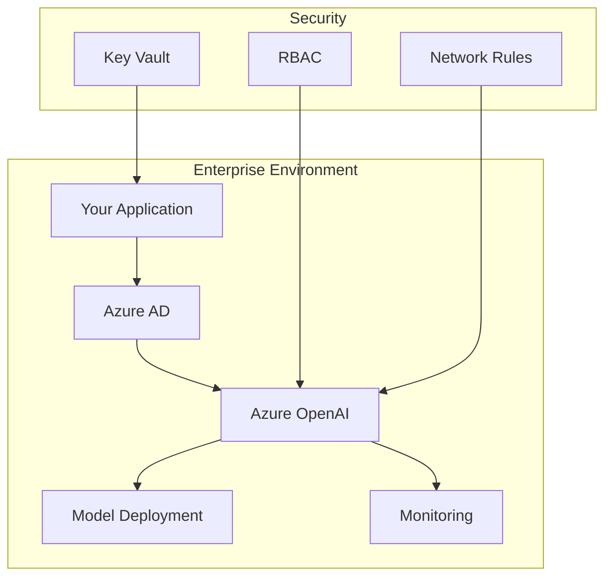
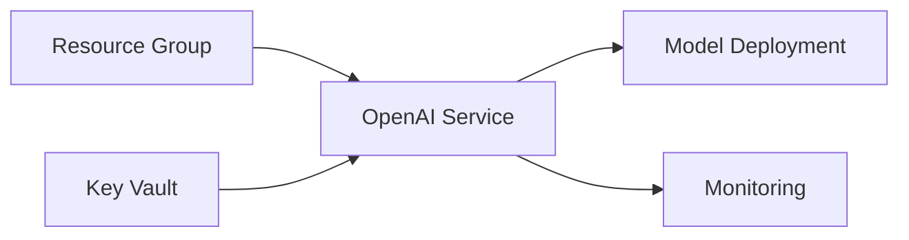
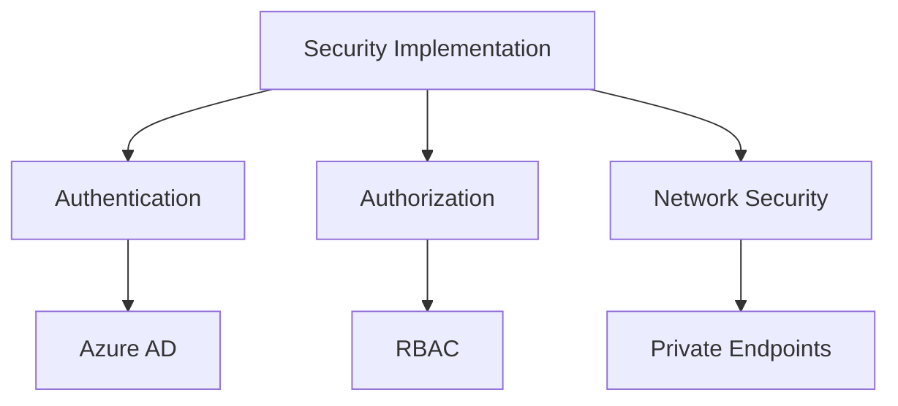
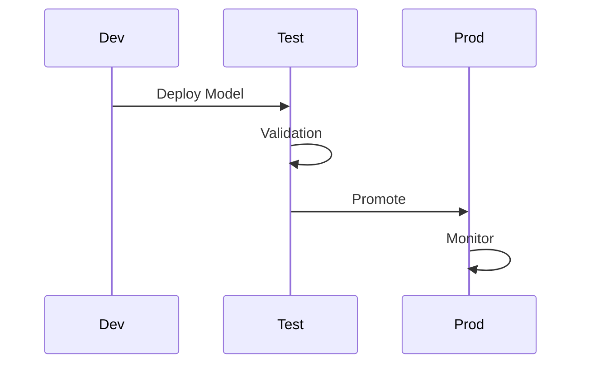

# Module 2: Environment Setup & Security Configuration

## 🎯 Learning Objectives
By completing this module, you will:
- Configure Azure OpenAI service for enterprise use
- Implement security best practices
- Set up monitoring and logging
- Deploy and validate model endpoints

## 🏗️ Architecture Overview

### System Components


## 📋 Prerequisites
- Completed Module 1
- Azure subscription with OpenAI access
- Administrative access to create resources
- Basic understanding of security concepts

## 🛠️ Exercises

### Exercise 1: Azure Environment Setup (30 minutes)

#### Objective
Set up a production-ready Azure OpenAI environment with proper resource organization and access controls.



#### Tasks
1. Create Resource Group
2. Configure OpenAI Service
3. Set up Key Vault
4. Implement Monitoring

### Exercise 2: Security Implementation (30 minutes)

#### Objective
Implement enterprise-grade security measures for your AI deployment.



#### Tasks
1. Configure Azure AD Integration
2. Set up RBAC Policies
3. Implement Network Security
4. Configure Audit Logging

### Exercise 3: Deployment & Validation (30 minutes)

#### Objective
Deploy and validate your secure AI environment.



#### Tasks
1. Model Deployment
2. Security Validation
3. Performance Testing
4. Monitoring Setup

## 🔨 Hands-on Labs

### Lab 1: Environment Configuration

```python
# Example: Configure Azure OpenAI client with secure credentials
from azure.identity import DefaultAzureCredential
from azure.keyvault.secrets import SecretClient
from azure.ai.openai import OpenAIClient

def setup_secure_client():
    # Get credentials from Azure AD
    credential = DefaultAzureCredential()
    
    # Access secrets from Key Vault
    key_vault_url = "https://your-keyvault.vault.azure.net/"
    secret_client = SecretClient(vault_url=key_vault_url, credential=credential)
    
    # Get OpenAI configuration
    endpoint = secret_client.get_secret("openai-endpoint").value
    
    # Create secure client
    client = OpenAIClient(
        endpoint=endpoint,
        credential=credential
    )
    return client
```

### Lab 2: Security Implementation

```python
# Example: Implement RBAC checks
def validate_access(client, resource_type):
    try:
        # Check if user has required roles
        roles = get_user_roles(client)
        required_roles = get_required_roles(resource_type)
        
        return all(role in roles for role in required_roles)
    except Exception as e:
        logging.error(f"Access validation failed: {e}")
        return False
```

### Lab 3: Monitoring Setup

```python
# Example: Configure monitoring
def setup_monitoring():
    # Initialize monitoring client
    monitor_client = MonitoringClient()
    
    # Define metrics to track
    metrics = [
        "requests_per_minute",
        "response_time",
        "error_rate",
        "token_usage"
    ]
    
    # Set up alerts
    for metric in metrics:
        monitor_client.create_alert_rule(
            metric_name=metric,
            threshold=get_threshold(metric),
            window_size="5m"
        )
```

## 🔍 Validation Checkpoints

### Environment Setup
- [ ] Resource group created
- [ ] OpenAI service deployed
- [ ] Key Vault configured
- [ ] Monitoring enabled

### Security Configuration
- [ ] Azure AD integration complete
- [ ] RBAC policies defined
- [ ] Network security implemented
- [ ] Audit logging configured

### Deployment Validation
- [ ] Model deployed successfully
- [ ] Security tests passed
- [ ] Performance metrics within SLA
- [ ] Monitoring alerts configured

## 📚 Additional Resources

### Documentation
- [Azure OpenAI Security Best Practices](https://docs.microsoft.com/azure/cognitive-services/openai/security)
- [Enterprise Deployment Guide](https://docs.microsoft.com/azure/architecture/example-scenario/ai/enterprise-openai)

### Tools
- Azure CLI scripts for automation
- Security assessment templates
- Monitoring dashboards

## ⚠️ Common Issues

### Environment Setup
- Quota limitations
- Permission errors
- Network connectivity

### Security
- Authentication failures
- RBAC misconfigurations
- Key management issues

### Deployment
- Model validation errors
- Performance bottlenecks
- Monitoring gaps

## 🎯 Success Criteria
You'll know you've mastered this module when you can:
1. Deploy a secure Azure OpenAI environment
2. Implement comprehensive security measures
3. Set up effective monitoring
4. Validate deployment readiness

## 🆘 Need Help?
- Review the troubleshooting guide
- Check Azure OpenAI documentation
- Contact your instructor
- Review example configurations

Remember: Security and proper configuration are crucial for enterprise AI deployments. Take time to understand each component and its role in the system.
